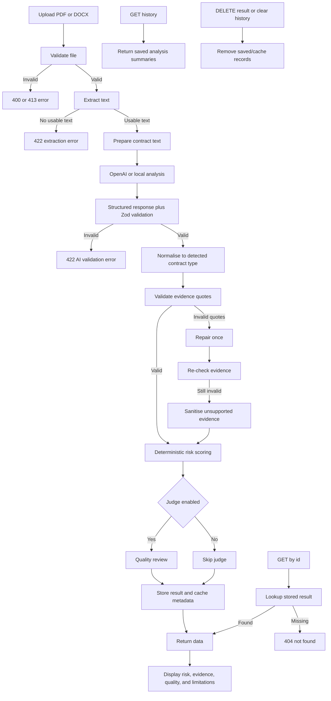

# RUBY Contract Upload & Legal-AI Analysis

A legal-tech vertical slice for uploading contracts, extracting text, running AI-assisted contract risk triage, validating structured analysis output, calculating a deterministic risk score, optionally reviewing analysis quality, and displaying saved outcomes in a React frontend.

This feature is positioned as **AI-assisted contract risk triage, not legal advice**.

---
## Candidate
- **GitHub username:** kmlascano
- **Submission time:** 03/07/2026 [20:51:01], GMT+1

---

## Tech stack

- Node.js 20+
- Express
- TypeScript
- React 18
- Vite
- OpenAI API
- Zod
- Vitest

---

## How to run locally

Assume Node 20+ is installed.

```bash
# 1. Clone your fork and switch to your branch
git clone https://github.com/<your-username>/ruby-law-exam.git
cd ruby-law-exam
git checkout candidate/<your-username>

# 2. Install dependencies
npm install

# 3. Create your local environment file
cp .env.example .env

# 4. Add your OpenAI key to .env
# OPENAI_API_KEY=your_key_here
# OPENAI_MODEL=gpt-5.4-nano
# AI_PROVIDER=openai

# Optional: use deterministic local/demo mode for UI smoke testing
# AI_PROVIDER=local

# 5. Start the app
npm run dev
```

Then open the local frontend URL shown in the terminal, upload a PDF or DOCX contract, and review the generated contract analysis.

---

## Useful commands

```bash
npm run dev
npm run build
npm run lint
npm run test
npm run audit:prod
```

---

## Environment variables

Create a `.env` file from `.env.example`.

```bash
cp .env.example .env
```

Expected variables:

```bash
OPENAI_API_KEY=your_key_here
OPENAI_MODEL=gpt-5.4-nano
OPENAI_JUDGE_MODEL=gpt-5.4-nano
AI_PROVIDER=openai
ENABLE_LLM_JUDGE=true
```

Notes:

- `OPENAI_API_KEY` is required for OpenAI-backed analysis.
- `AI_PROVIDER=local` can be used for deterministic local/demo smoke testing.
- `ENABLE_LLM_JUDGE=true` enables the optional analysis-quality review layer.
- Real `.env` files should never be committed.

---

## What the app does

The app supports a complete contract-analysis workflow:

1. User uploads a PDF or DOCX contract.
2. Backend validates file type and size.
3. Backend extracts readable text.
4. AI service prepares the contract text for model review.
5. The model classifies the contract and returns structured legal-risk signals.
6. Zod validates the response shape.
7. Backend checks evidence quote fidelity.
8. Backend repairs or sanitises invalid evidence where needed.
9. Backend normalises findings to the detected contract type.
10. Backend calculates the final risk score deterministically.
11. Optional judge reviews the quality of the generated analysis.
12. Result is stored in memory and shown in the frontend.
13. Saved analysis history lets users reopen prior/cache-returned outcomes.

---

## Design decisions

I structured the project as a clean vertical slice rather than a broad production system. The backend separates upload routing, controllers, text extraction, AI orchestration, deterministic scoring, optional quality review, schemas, and in-memory storage. Routes stay thin, controllers translate HTTP input/output, and services own the business logic. This makes the code easier to test, review, and reason about.

The AI output is deliberately not treated as a free-form legal opinion. The model produces structured analysis signals: contract type, clause checks, risk flags, evidence, recommendations, confidence, and limitations. The backend validates and normalises that output, verifies evidence quotes where possible, removes unsupported or out-of-scope findings, and calculates the final numeric risk score deterministically. This is more stable and explainable than asking the model to choose a score directly.

The app also stores generated analyses in memory and exposes a saved-analysis history view so users can reopen previous results without re-running AI. This is suitable for the assignment/demo scope, but not intended as durable production storage.

---

## AI prompt strategy

The prompt frames the model as a legal-tech contract risk triage assistant, not a lawyer. It instructs the model to use only the uploaded contract text and the internal legal-risk checklist, avoid invented statutes or external authorities, classify the contract into one of the supported contract types, and return structured JSON matching the expected schema.

The model evaluates checklist rules as `present`, `missing`, or `ambiguous`. Present and ambiguous findings should include short exact evidence quotes from the uploaded contract. Missing clauses use empty evidence arrays because absence cannot be directly quoted. Risk findings include severity, explanation, source/checklist rationale, and practical review recommendations.

The model does **not** calculate the final risk score. It is instructed to return `riskScore` as `0`, and the backend recalculates the final 0–100 score deterministically after validation. This keeps scoring testable, auditable, and easier to calibrate.

The checklist is dataset-informed but not dataset-ingested at runtime. Public legal-AI datasets such as CUAD and ContractNLI informed the clause categories and evidence-backed output format, but the app does not train a model, download datasets, or run legal RAG. Runtime analysis uses only the uploaded contract text plus the internal checklist.

I also added an optional LLM-as-a-judge quality review. This judge does not decide whether the contract is legally safe; it reviews whether the generated analysis is grounded, internally consistent, evidence-backed, and safe to display. Its quality score is shown separately from the contract risk score.

---

## Risk scoring decision

The final `riskScore` is calculated by the backend, not the model.

The AI analysis provides structured inputs such as:

- clause status
- clause risk level
- risk flag severity
- evidence grounding
- detected contract type
- missing clauses
- recommendations

The scoring service then converts those signals into a 0–100 score. This makes the score more deterministic, easier to test, and easier to calibrate across sample contracts.

The calibration aims for:

- well-formed NDA: low risk
- incomplete employment agreement: medium risk
- service agreement with liability/privacy/indemnity issues: high risk

---

## Quality review decision

The optional quality review is separate from contract risk.

- **Risk score** means: how risky the contract appears to be.
- **Quality score** means: how reliable and evidence-backed the generated analysis appears to be.

The judge checks whether the analysis is grounded, internally consistent, and safe to display. It does not decide whether the contract is legally safe.

Important quality-review rules:

- Missing clauses may have empty evidence because absence cannot be quoted.
- Present or ambiguous clauses should normally include exact evidence.
- Uploaded-contract risk flags should normally include exact evidence.
- Checklist-based missing-clause risk flags may have empty evidence.

---

## API response shape

Successful responses are wrapped in a `data` envelope.

```json
{
  "data": {
    "id": "string",
    "filename": "string",
    "type": "NDA | Employment | Service Agreement | Lease | Other",
    "riskScore": 0,
    "missingClauses": ["string"],
    "recommendations": ["string"],
    "classification": {
      "reason": "string",
      "confidence": "low | medium | high",
      "evidence": [
        {
          "quote": "exact excerpt",
          "clauseHeading": "optional"
        }
      ]
    },
    "clauseChecks": [
      {
        "ruleId": "string",
        "clauseName": "string",
        "status": "present | missing | ambiguous",
        "riskLevel": "low | medium | high",
        "reason": "string",
        "evidence": [
          {
            "quote": "exact excerpt"
          }
        ],
        "recommendation": "string"
      }
    ],
    "riskFlags": [
      {
        "ruleId": "string",
        "title": "string",
        "severity": "low | medium | high",
        "explanation": "string",
        "evidence": [
          {
            "quote": "exact excerpt"
          }
        ],
        "reference": {
          "source": "Uploaded contract | Internal legal risk checklist",
          "rationale": "why this checklist rule matters"
        },
        "recommendation": "string"
      }
    ],
    "confidence": "low | medium | high",
    "limitations": ["string"],
    "qualityReview": {
      "status": "pass | warn | fail",
      "qualityScore": 0,
      "requiresHumanReview": true,
      "issues": [
        {
          "severity": "low | medium | high",
          "field": "string",
          "message": "string"
        }
      ]
    },
    "createdAt": "ISO timestamp",
    "documentHash": "string",
    "modelName": "string",
    "promptVersion": "string",
    "analysisVersion": "string",
    "fromCache": false
  }
}
```

---

## Error handling

| HTTP status | Code | Meaning |
|---|---|---|
| 400 | `NO_FILE` | No upload was provided. |
| 400 | `INVALID_FILE` | Upload was rejected, usually because it was not PDF/DOCX. |
| 400 | `UNSUPPORTED_FILE_TYPE` | Extractor received an unsupported MIME type. |
| 413 | `FILE_TOO_LARGE` | Uploaded file exceeded the size limit. |
| 422 | `TEXT_EXTRACTION_EMPTY` | File parsed but produced too little readable text. |
| 422 | `TEXT_EXTRACTION_FAILED` | File could not produce usable text for analysis. |
| 422 | `AI_INVALID_JSON` | AI response could not be parsed as JSON. |
| 422 | `AI_EMPTY_RESPONSE` | AI response was empty. |
| 422 | `AI_SCHEMA_VALIDATION_FAILED` | AI response did not match the expected schema. |
| 500 | `OPENAI_API_KEY_MISSING` | OpenAI key is missing when OpenAI mode is required. |
| 500 | `AI_PROVIDER_ERROR` | Provider call failed. |
| 500 | `ANALYSIS_FAILED` | Unexpected server failure. |
| 404 | `NOT_FOUND` | Requested analysis ID was not found in memory. |

---

## Architecture overview



---

## Known limitations & what I would do differently

This is a demo-oriented vertical slice, so storage is in memory and saved analyses disappear after a backend restart. In production I would replace this with persistent storage, audit logs, user authentication, and explicit cache invalidation rules.

PDF/DOCX text extraction is supported, but OCR is not implemented. Scanned PDFs or documents with poor embedded text may fail extraction or produce incomplete analysis. I would add OCR, file signature checks, malware scanning, and richer extraction diagnostics for a production system.

The app does not provide jurisdiction-specific legal advice. The checklist is general contract-risk triage guidance, not a substitute for lawyer review. With more time, I would add jurisdiction selection, legal-review-approved checklist versions, and stronger evaluation fixtures.

The evidence system validates quote presence, but it does not yet map quotes to PDF page coordinates or character spans for highlighting. I would add deterministic quote-to-span matching and a document viewer with evidence highlighting.

The final risk score is deterministic, which makes it easier to test and explain, but calibration is still an approximation. I would add a development-only score breakdown, more fixture-based tests, and a small evaluation dashboard comparing expected risk bands across sample contracts.

The optional quality judge is useful, but still model-dependent. I added deterministic checks around evidence and schema consistency, but with more time I would expand the non-LLM evaluator so quality scoring is less dependent on a second model call.

---

## Recommended future improvements

- Replace in-memory storage with persistent storage and an audit trail.
- Add durable cache indexing and cache invalidation strategy.
- Add deterministic quote-to-character-span matching and page-aware extraction for PDF evidence locations.
- Add OCR support for scanned PDFs.
- Add malware scanning and deeper file signature validation before extraction.
- Add a document viewer with evidence highlighting.
- Move checklist content into versioned configuration with legal reviewer approval.
- Add jurisdiction selection so checklist rules can be tailored by market.
- Add end-to-end tests and sample contract fixtures for the provided sample contracts.
- Add dataset-backed evaluation fixtures using CUAD-style clause categories and ContractNLI-style evidence checks.
- Add richer risk-score breakdown output in development mode.
- Add quality-review dashboards to track recurring analysis weaknesses.
- Add stricter handling for “not applicable” clauses before model output reaches scoring.

---

## Dataset-informed legal-tech rationale

The project should not download or ship full public datasets at runtime. Instead, public legal-AI datasets inform the system design and future evaluation strategy.

| Dataset / benchmark | How it informs this project |
|---|---|
| CUAD | Inspires clause categories and missing-clause checklist design for contract review. |
| ContractNLI | Inspires the decision → reason → evidence pattern and evidence-backed clause checks. |
| MCC | Useful future source for contract-type examples, but metadata should not be treated as perfect ground truth. |
| CLAUSE | Useful future stress test for subtle contractual discrepancies and judge-model evaluation. |
| LegalBench | Useful future benchmark for broader legal reasoning, not a direct contract-upload runtime dependency. |
| Legal RAG Bench | Supports the general principle that grounded evidence and retrieval quality matter, but it is not contract-specific. |

---

## References for project documentation

- CUAD — https://www.atticusprojectai.org/cuad/
- ContractNLI — https://stanfordnlp.github.io/contract-nli/
- LegalBench — https://github.com/HazyResearch/legalbench
- Legal RAG Bench — https://arxiv.org/abs/2603.01710
- OpenAI Structured Outputs guide — https://platform.openai.com/docs/guides/structured-outputs

---

## Checklist

- [x] TypeScript `strict: true` — no intentional `any`
- [x] `npm run lint` passes with no errors
- [x] At least 2 unit tests pass (`npm test`)
- [x] `.env.example` committed with no real keys
- [x] File type and size validated in backend
- [x] Loading, error, and success states in UI
- [x] README explains setup and design decisions
